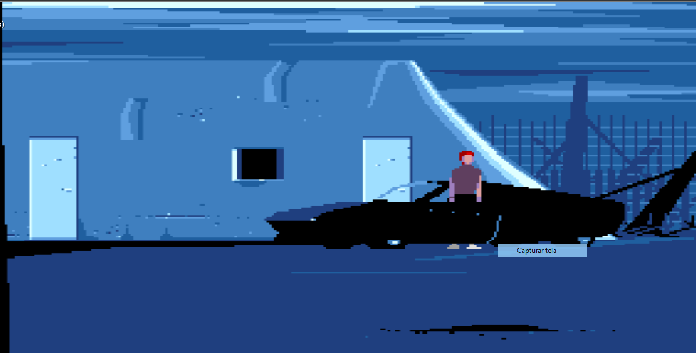

# RawGL-PS2

This is a homebrew port of another world, targeting to PS2, Using raw(gl)
as base.

This port uses the unofficial [PS2DEV SDK](https://github.com/ps2dev/ps2dev) and SDL2.

## How to run
Pick the raw(gl)-ps2 executable that can be found on releases section,
unzip it then get the data files of the game and go to pcsx2 for execute the elf file or in real hardware: transfer the folder unzipped to your pen-drive,
run wLaunchELF and find the game on `mass0:`, then hit the .ELF file and done.

## Controls:
Start: Pause \
Cross: Run/Attack \
DPad: Move \
Left analog: Move
